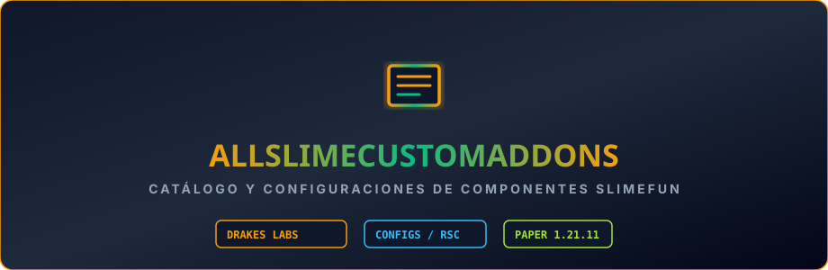

  

# AllSlimeCustomAddons

> ### 🏰 ¡Únete a la Comunidad Oficial de DrakesCraft!
> 
> * 🎮 **IP del Servidor**: `play.drakescraft.net` *(Java 1.21.11 & Bedrock)*
> * 💬 **Discord Oficial**: [discord.gg/drakescraft](https://discord.gg/rR7FbfCt9Y)
> * 🌐 **Web & Guía**: [drakescraft.net](https://drakescraft.net) — 🛒 **Tienda**: [tienda.drakescraft.net](https://tienda.drakescraft.net)
> 
> *¡Juega con este addon y más de 80 expansiones optimizadas en vivo en nuestra network de supervivencia técnica!*

---

Repositorio de **configuraciones, recetas, items personalizados y modelos de investigación** para addons de Slimefun basados en configuraciones YAML y SlimeCustomizer. Mantenido y auditado por **DrakesCraft Labs** para Paper/Purpur 1.21.11 en Java 21.

---

## 🎯 Objetivo

Centralizar, depurar y estructurar configuraciones de addons comunitarios, asegurando que no contengan IDs en conflicto, puertas traseras o recetas rotas antes de integrarse al entorno de producción de DrakesCraft.

---

## ⚡ Estructura y Contenidos

- **Configuraciones de SlimeCustomizer**:
  - Árboles de crafteo, generadores temáticos y máquinas de eventos.
- **Auditoría de Seguridad**:
  - Exclusión de addons no verificados o con riesgos de seguridad conocidos.
- **Traducción y Estandarización**:
  - Normalización de nombres, descripciones y compatibilidad con `Slimefun4-Drake`.

---

## 🛠️ Entorno y Compatibilidad

- **Servidor**: Paper / Purpur 1.21.11
- **Java**: 21
- **Dependencias**:
  - `Slimefun4-Drake`
  - `SlimeCustomizer`

---

## 📜 Créditos

- **Comunidad Slimefun & Creadores de Configuraciones**
- **Curaduría y Auditoría**: **DrakesCraft Labs**

## ⚖️ Upstream Attribution & License / Licencia y Créditos

- **Original Project / Upstream**: Slimefun4 Community Addon.
- **Port & Maintenance**: DrakesCraft Labs team (Compatibility for Paper / Purpur 1.21.11).
- **License**: GPL-3.0 / MIT.
- **Source Code**: [GitHub Repository](https://github.com/DrakesCraft-Labs/AllSlimeCustomAddons)
- **Support & Issues**: [GitHub Issues](https://github.com/DrakesCraft-Labs/AllSlimeCustomAddons/issues) | [Discord](https://discord.gg/rR7FbfCt9Y)

*This project is an open-source derivative work maintained by DrakesCraft Labs under the terms of its original license. All original assets and concepts belong to their respective creators.*
